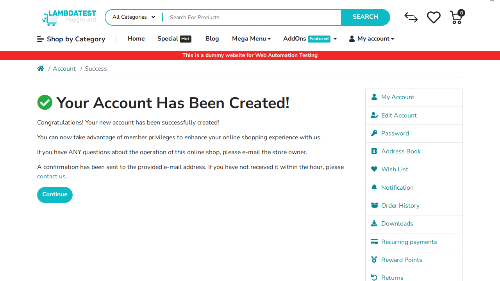

# Bug Report - Automation Testing Portfolio

## BUG-001: Password does not display error when exceeding the maximum limit

**Status:** Open  
**Severity:** Medium  
**Test Date:** 2026-04-20  
**Tester:** Maulana Malik Ibrahim  
**Website:** LambdaTest E-Commerce Playground  

### Encvironment
**Environment:**
- Browser: Chromium 
- OS: Ubuntu 24.04 (codespace)
- Device: Desktop (1920x1080)
- URL: https://ecommerce-playground.lambdatest.io/register
- Environment: Production

### Summary
Password does not display error when exceeding the maximum limit

### Steps to Reproduce
1. Buka halaman register: https://ecommerce-playground.lambdatest.io/register
2. fill all field with valid credential and fill in the password field until more than 20 characters
3. click submit button

### Expected Result
Show message error: "Password must be between 4 and 20 characters!"

### Actual Result
Register success!! nothing problem

### Screenshot
(https://youtu.be/TcPNTjh8_wk?si=b8TXlYfP9qgZcdwR)

note: click to watch video

### Additional Notes

---
